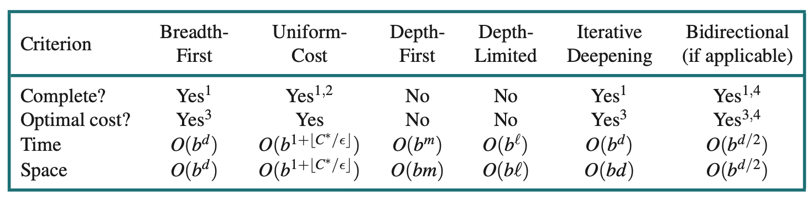

#### _January 13th, 2023_

# Search Algorithms

A search algorithm takes a search problem as input and returns a solution, or an indication of failure. In this chapter we consider algorithms that superimpose a search tree over the state- space graph, forming various paths from the initial state, trying to find a path that reaches a goal state. Each node in the search tree corresponds to a state in the state space and the edges in the search tree correspond to actions. The root of the tree corresponds to the initial state of the problem.

## Best-first search

How do we decide which node from the frontier to expand next? A very general approach is called best-first search, in which we choose a node, n, with minimum value of some evaluation function, `f(n)`.

## Measuring problem-solving performance

We can evaluate an algorithm’s performance in four ways:

- `Completeness`: Is the algorithm guaranteed to find a solution when there is one, and to correctly report failure when there is not?
- Cost `optimality`: Does it find a solution with the lowest path cost of all solutions?7
- `Time complexity`: How long does it take to find a solution? This can be measured in
  seconds, or more abstractly by the number of states and actions considered.
- `Space complexity`: How much memory is needed to perform the search?

To be complete, a search algorithm must be `systematic` in the way it explores an infinite state space, making sure it can eventually reach any state that is connected to the initial state.

## Frontier

We need a data structure to store the frontier. Three kinds of queues are used in search algorithms:

- A priority queue first pops the node with the minimum cost according to some evaluation function, `f(n)` . It is used in best-first search.
- A FIFO queue or first-in-first-out queue first pops the node that was added to the queue
  first; we shall see it is used in breadth-first search.
- A LIFO queue or last-in-first-out queue (also known as a stack) pops first the most recently added node; we shall see it is used in depth-first search.

In many AI problems, the graph is represented only implicitly by the initial state, actions, and transition model. For an implicit state space, complexity can be measured in terms of `d`, the depth or number of actions in an optimal solution; `m`, the maximum number of actions in any path; and `b`, the branching factor or number of successors of a node that need to be considered.

# Uninformed Search Strategies

An uninformed search algorithm is given no clue about how close a state is to the goal(s).

## Breadth-first search

We could implement breadth-first search where the evaluation function `f(n)` is the depth of the node—that is, the number of actions it takes to reach the node.

Then the total number of nodes generated is
`1+b+b^2 +b^3 +···+b^d = O(b^d)`

## Dijkstra’s algorithm or uniform-cost search

When actions have different costs, an obvious choice is to use best-first search where the evaluation function is the cost of the path from the root to the current node. This is called Di- jkstra’s algorithm by the theoretical computer science community, and uniform-cost search by the AI community.

## Depth-first search and the problem of memory

Depth-first search always expands the deepest node in the frontier first. It could be implemented as a call to BEST-FIRST-SEARCH where the evaluation function f is the negative of the depth.

Depth-first search is not cost-optimal; it returns the first solution it finds, even if it is not cheapest.

For finite state spaces that are trees it is efficient and complete; for acyclic state spaces it may end up expanding the same state many times via different paths, but will (eventually) systematically explore the entire space.
In cyclic state spaces it can get stuck in an infinite loop; therefore some implementations of depth-first search check each new node for cycles. Finally, in infinite state spaces, depth- first search is not systematic: it can get stuck going down an infinite path, even if there are no cycles. Thus, depth-first search is incomplete.

With all this bad news, why would anyone consider using depth-first search rather than breadth-first or best-first? The answer is that for problems where a tree-like search is feasible, depth-first search has much smaller needs for memory. A depth-first tree-like search takes time proportional to the number of states, and has memory complexity of only O(bm), where b is the branching factor and m is the maximum depth of the tree.

## Depth-limited and iterative deepening search

To keep depth-first search from wandering down an infinite path, we can use depth-limited search, a version of depth-first search in which we supply a depth limit, l, and treat all nodes at depth l as if they had no successors (see Figure 3.12). The time complexity is O(bl) and the space complexity is O(bl). Unfortunately, if we make a poor choice for l the algorithm will fail to reach the solution, making it incomplete again.

Iterative deepening search solves the problem of picking a good value for l by trying all values: first 0, then 1, then 2, and so on—until either a solution is found, or the depth- limited search returns the failure value rather than the cutoff value.

The time complexity is `O(b^d)` when there is a solution, or `O(b^m)` when there is none.

The total number of nodes generated in the worst case is:

`N(IDS) = (d+1)b^1 + (d)b^2 + (d − 1)b^3 · · · + b^d = O(b^d)`

while,
`N(DLS) = b^0 + b^1 + b^2 + ... + b^(d-2) + b^(d-1) + b^d = O(b^d)`.

Thus,
`N(IDS)/N(DLS) = b/(b-1)`.

## Bidirectional search

bidirectional search simultaneously searches forward from the initial state and backwards from the goal state(s), hoping that the two searches will meet. The motivation is that `b^d/2 + b^d/2` is much less than `b^d`.

## Comparing uninformed search algorithms

The complexity of uniform-cost search is characterized in terms of `C∗`, the cost of the optimal solution, and `ǫ`, a lower bound on the cost of each action, with ǫ > 0. Then the algorithm’s worst-case time and space complexity is `O(b^(1+⌊C∗/ǫ⌋))`, which can be much greater than `b^d` . This is because uniform-cost search can explore large trees of actions with low costs before exploring paths involving a high-cost and perhaps useful action. When all action costs are equal, `O(b^(1+⌊C∗/ǫ⌋))` is just `b^(d+1)`, and uniform-cost search is similar to breadth-first search.

# Informed (Heuristic) Search Strategies

This section shows how an informed search strategy—one that uses domain-specific hints about the location of goals—can find solutions more efficiently than an uninformed strategy. The hints come in the form of a heuristic function, denoted `h(n)`:

`h(n)` = estimated cost of the cheapest path from the state at node n to a goal state.

Other notation:

- g(n) = known cost of the particular path to reach n
- h(n) = estimated optimal cost from n to goal
- h\*(n) = true optimal cost from n to goal (unknown to agent)
- g\*(n) = true optimal cost from initial state to state of n (may be unknown to agent)
- f(n) = g(n)+h(n) = estimated optimal total cost through n

## Greedy best-first search

Greedy best-first search is a form of best-first search that expands first the node with the lowest h(n) value—the node that appears to be closest to the goal—on the grounds that this is likely to lead to a solution quickly. So the evaluation function f (n) = h(n).

Complete:

- Tree version can get stuck in loops (moderately easy to prevent)
- Graph version is complete in finite spaces
- Neither Tree nor Graph version is complete in infinite spaces

Time: `O(b^m)`

- A good heuristic can give dramatic improvement

Space: `O(b^m)`

- Keeps all nodes in memory

Optimal: No

## A-star search

The most common informed search algorithm is A∗ search (pronounced “A-star search”), a
best-first search that uses the evaluation function

f (n) = g(n) + h(n)

where `g(n)` is the path cost from the initial state to node n, and `h(n)` is the estimated cost of the shortest path from n to a goal state, so we have

f (n) = estimated cost of the best path that continues from n to a goal.

A∗ search is complete.11 Whether A∗ is cost-optimal depends on certain properties of the heuristic. A key property is admissibility: an admissible heuristic is one that never overestimates the cost to reach a goal. (An admissible heuristic is therefore optimistic.)
